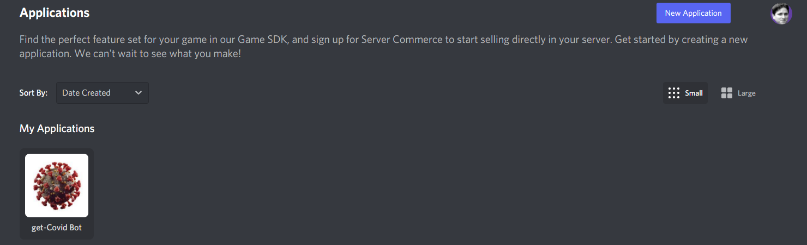
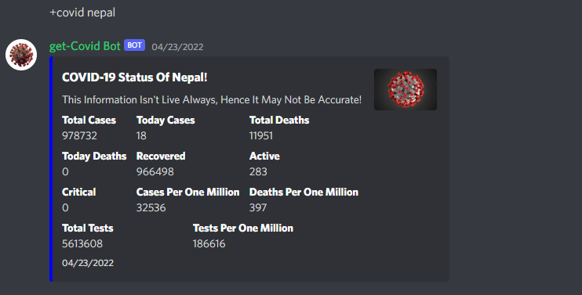

# get-Covid-Bot
Discord bot using Discord.py to provide updated Covid-19 information


## Table of Content
- [Requirements](#requirements)
  * [Create a Discord bot- Discord Developer Portal](#create-a-discord-bot--discord-developer-portal)
  * [Python Libraries](#python-libraries)
- [API used](#api-used)
- [Pulling Data from API](#pulling-data-from-api)
- [Embeding Covid-19 Data into Discord Bot](#embeding-covid-19-data-into-discord-bot)
- [To launch the bot on your server](#to-launch-the-bot-on-your-server)
- [Hosting](#hosting)

## Requirements

### Create a Discord bot- Discord Developer Portal 
You will require a Discord account. Then go to [Discord Developer Portal](https://discord.com/developers/docs/intro) and create a new application. fill the required details. <br>
<br>


After this go to the 'bot' option and create the bot. Check all the permissions needed. Also make sure to enable all the Intent options as well.
Copy the bot TOKEN and use it as shown in bot.py to run the bot.

### Python Libraries
You will also need some python libraries installed. They are listed below

```python
import discord
import os
import asyncio
import requests
from discord.ext import commands
```


## API used
API used: [Coronavirus-19-api](https://coronavirus-19-api.herokuapp.com/countries/). 

The URL format for the API is 
```
https://coronavirus-19-api.herokuapp.com/countries/{country_name}
````

**Data Extracted from API**
- Total Cases till Date 
- Total daily Cases (today)
- Total Deaths till Date
- Total Deaths (today)
- Recovered Cases 
- Active Cases
- Critical Cases
- Cases Per One Million
- Deaths Per One Million
- Total Tests till Date
- Tests Per One Million


## Pulling Data from API

```python
url = f"https://coronavirus-19-api.herokuapp.com/countries/{countryName}"
stats = requests.get(url)
json_stats = stats.json()
country = json_stats["country"]
totalCases = json_stats["cases"]
todayCases = json_stats["todayCases"]
totalDeaths = json_stats["deaths"]
todayDeaths = json_stats["todayDeaths"]
recovered = json_stats["recovered"]
active = json_stats["active"]
critical = json_stats["critical"]
casesPerOneMillion = json_stats["casesPerOneMillion"]
deathsPerOneMillion = json_stats["deathsPerOneMillion"]
totalTests = json_stats["totalTests"]
testsPerOneMillion = json_stats["testsPerOneMillion"]
```
## Embeding Covid-19 Data into Discord Bot 
```python
embed2 = discord.Embed(title=f"**COVID-19 Status Of {country}**!", 
description="This Information Isn't Live Always, Hence It May Not Be Accurate!", 
colour=0x0000ff, timestamp=ctx.message.created_at)

embed2.add_field(name="**Total Cases**", value=totalCases, inline=True)
embed2.add_field(name="**Today Cases**", value=todayCases, inline=True)
embed2.add_field(name="**Total Deaths**", value=totalDeaths, inline=True)
embed2.add_field(name="**Today Deaths**", value=todayDeaths, inline=True)
embed2.add_field(name="**Recovered**", value=recovered, inline=True)
embed2.add_field(name="**Active**", value=active, inline=True)
embed2.add_field(name="**Critical**", value=critical, inline=True)
embed2.add_field(name="**Cases Per One Million**", value=casesPerOneMillion, inline=True)
embed2.add_field(name="**Deaths Per One Million**", value=deathsPerOneMillion, inline=True)
embed2.add_field(name="**Total Tests**", value=totalTests, inline=True)
embed2.add_field(name="**Tests Per One Million**", value=testsPerOneMillion, inline=True)

```
You can look through the covid.py file to understand the code. Also check out the bot.py file to see how the bot is configured to the discord bot you just created.

## To launch the bot on your server
First, click on your bot in the Discord Developer Portal. Select oAuth2 > Url Generator. Generate a URL and copy it onto your browser. Now you can add bot onto your server. To use the bot type +covid (country-name)
```
+covid Nepal
```
The Result should look something like this:<br><br>


## Hosting
Currently, I haven't hosted it on any server yet. This was just a fun project i wanted to try out.
